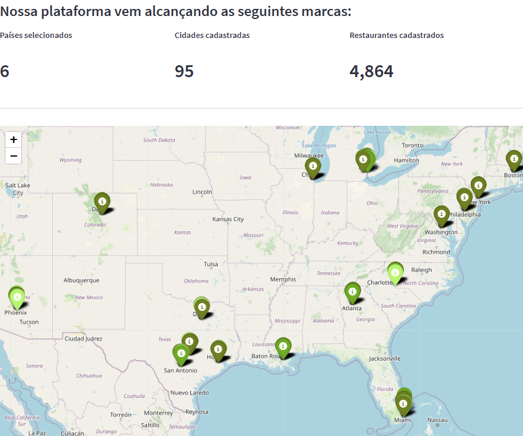

# Projeto Fome Zero !

# [1] O PROBLEMA DE NEGÓCIO
A empresa Fome Zero! é um marketplace de restaurentes, tendo como núcleo do seu negócio propiciar o encontro e as negociações entre clientes e restaurantes. Para tanto, a empresa possui uma plataforma tecnológica por meio da qual são disponibilizadas informações referentes aos restaurantes, dentre as quais o endereço, tipo de culinária servida, se possui reservas, se faz entregas e também uma nota de avaliação dos serviços e produtos de cada restaurante.
Nesse contexto, o CEO da empresa necessita identificar os pontos chaves do empreendimento, contando para isso com o trabalho do cientista de dados, que deve buscar nos dados as respostas às questões de interesse para o desenvolvimento do negócio, dentre as quais:
## Questões Gerais:
1) quantos restaurantes únicos estão registrados?
2) Quantos países únicos estão registrados?
3) Quantas cidades únicas estão registradas?
4) Qual o total de avaliações feitas?
5) Qual o total de tipos de culinária registrados?

## Questões sobre os países:
1) Qual o nome do país que possui mais cidades registradas?
2) Qual o nome do país que possui mais restaurantes registrados?
3) Qual o nome do país que possui mais restaurantes com o nível de preço igual a 4 registrados?
4) Qual o nome do país que possui a maior quantidade de tipos de culinária distintos?
5) Qual o nome do país que possui a maior quantidade de avaliações feitas?
6) Qual o nome do país que possui a maior quantidade de restaurantes que fazem entrega?
7) Qual o nome do país que possui a maior quantidade de restaurantes que aceitam reservas?
8) Qual o nome do país que possui, na média, a maior quantidade de avaliações registrada?
9) Qual o nome do país que possui, na média, a maior nota média registrada?
10) Qual o nome do país que possui, na média, a menor nota média registrada?
11) Qual a média de preço de um prato para dois por país?

## Questões sobre as cidades:
1) Qual o nome da cidade que possui mais restaurantes registrados?
2) Qual o nome da cidade que possui mais restaurantes com nota média acima de 4?
3) Qual o nome da cidade que possui mais restaurantes com nota média abaixo de 2.5?
4) Qual o nome da cidade que possui o maior valor médio de um prato para dois?
5) Qual o nome da cidade que possui a maior quantidade de tipos de culinária distintas?
6) Qual o nome da cidade que possui a maior quantidade de restaurantes que fazem reservas?
7) Qual o nome da cidade que possui a maior quantidade de restaurantes que fazem entregas?
8) Qual o nome da cidade que possui a maior quantidade de restaurantes que aceitam pedidos online?

## Questões sobre os restaurantes:
1) Qual o nome do restaurante que possui a maior quantidade de avaliações?
2) Qual o nome do restaurante com a maior nota média?
3) Qual o nome do restaurante que possui o maior valor de uma prato para duas pessoas?
4) Qual o nome do restaurante de tipo de culinária brasileira que possui a menor média de avaliação?
5) Qual o nome do restaurante de tipo de culinária brasileira, e que é do Brasil, que possui a maior média de avaliação?
6) Os restaurantes que aceitam pedido online são também, na média, os restaurantes que mais possuem avaliações registradas?
7) Os restaurantes que fazem reservas são também, na média, os restaurantes que possuem o maior valor médio de um prato para duas pessoas?
8) Os restaurantes do tipo de culinária japonesa dos Estados Unidos da América possuem um valor médio de prato para duas pessoas maior que as churrascarias americanas (BBQ)?

## Questões sobre os tipos de culinária:
1) Dos restaurantes que possuem determinado tipo de culinária (ex: italiana), qual o nome do restaurante com a maior/menor média de avaliação?
2) Qual o tipo de culinária que possui o maior valor médio de um prato para duas pessoas?
3) Qual o tipo de culinária que possui a maior nota média?
4) Qual o tipo de culinária que possui mais restaurantes que aceitam pedidos online e fazem entregas?

# [2] AS PREMISSAS DO NEGÓCIO
O desenvolvimento do projeto tomou por base as seguintes premissas:
- I - base de dados com informações de restaurantes localizados em 15 países.
- II - o modelo de negócio assumido foi do tipo marketplace.
- III - as três principais visões de negócio foram: visão países, visão cidades e visão culinárias.

# [3] ESTRATÉGIA DA SOLUÇÃO
O painel estratégico foi desenvolvido utilizando as métricas que refletem as três principais visões do modelo de negócio da empresa, quais sejam: 
- Visão dos países em que a empresa atua,
- Visão das cidades,
- Visão dos tipos culinários.

Cada visão está representada pelo seguinte conjunto de métricas:
## (1) Visão de Países:
- Quantidade de restaurantes registrados por país
- Quantidade de cidades registradas por país
- Quantidade média de avaliações por país
- Preço médio do prato para dois por país

## (2) Visão das Cidades:
- Cidades com mais restaurantes registrados
- Quantidade de restaurantes avaliados acima de 4,0 por cidade
- Quantidade de restaurantes avaliados abaixo de 2,5 por cidade
- Cidades com a maior quantidade de restaurantes com tipos culinários distintos

## (3) Visão das Culinárias:
- Melhores restaurantes por tipo culinário
- Restaurantes melhor avaliados
- Tipos culinários melhor avaliados
- Tipos culinários pior avaliados

# [4] TOP 3 INSIGHTS DE DADOS
- i) dos 5.904 restaurantes cadastrados em 15 países, a Índia com 3.120 e os EUA com 1.378 representam mais de 76% de todos os restaurantes neste marketplace. Portanto, nos demais 13 países há grande potencial de crescimento do negócio.
- ii) o hábito dos consumidores de avaliar os serviços se reflete no histograma da Quantidade Média de Avaliações por País. Dois países, cada qual possuidor de apenas 3 cidades cadastradas, encontram-se nos extremos deste histograma. De um lado, na Indonésia, os restaurantes recebem, em média 1.113 avaliações. De outro lado, no Brasil, os restaurantes recebem uma média de 12 avaliações.
- iii) entre países de economia desenvolvida, os números são também heterogêneos. Tomando como exemplo EUA e Inglaterra, os EUA têm aproximadamente: (a) 3,5 vezes mais restaurantes cadastrados, (b) 4,5 vezes mais cidades registradas, (c) 4 vezes mais avaliações por restaurante, (d) nenhum restaurante com avaliação abaixo de 2,5, (e) pelo menos 10 vezes mais cidades com restaurantes avaliados com nota acima de 4,0. A partir desses números, é possível direcionar campanhas para aumentar a presença da marca da empresa na Inglaterra.

# [5] O PRODUTO FINAL DO PROJETO
É dado por um painel online, hospedado em uma Cloud e disponível para acesso em qualquer dispositivo conectado à internet.
O painel pode ser acessado por meio do seguinte link: 
- https://fomezero-iw9um7ljd7.streamlit.app/

# [6] CONCLUSÃO
O objetivo deste projeto foi o de criar um conjunto de gráficos e/ou tabelas para exibir as métricas do negócio da melhor forma possível para o CEO.
No painel, a visão de países indica a existência de grande potencial para crescimento dos negócios.

# [7] PRÓXIMOS PASSOS
O projeto pode ser aprimorado para: 
- (i) incluir novos filtros de informações, de modo a aumentar a funcionalidade para o usuário,
- (ii) adicionar novas visões de negócios, que permitam auxiliar a tomada de decisões gerenciais diferenciadas, de acordo com as características de cada país ou grupo de países, e
- (iii) criar novos indicadores, voltados tanto para o crescimento do negócio, quanto para o aprimoramento da qualidade do serviço prestado.
